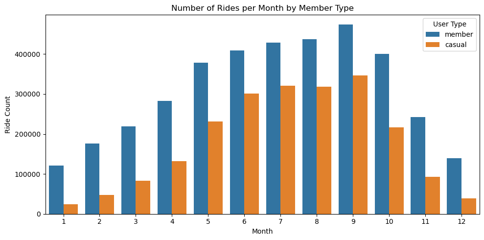
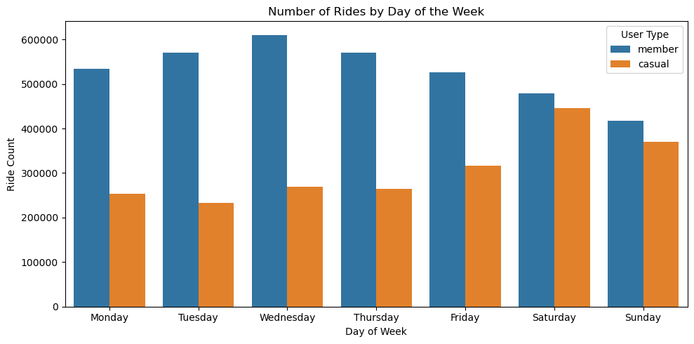
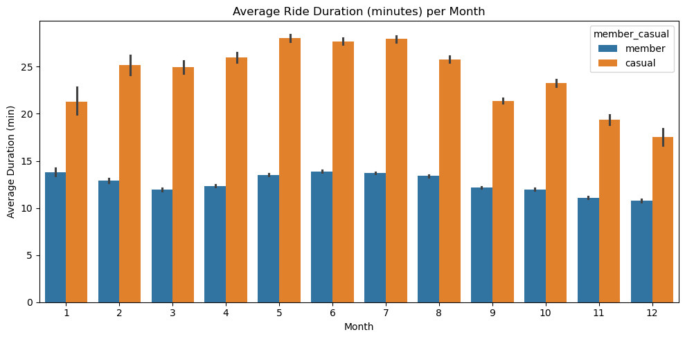
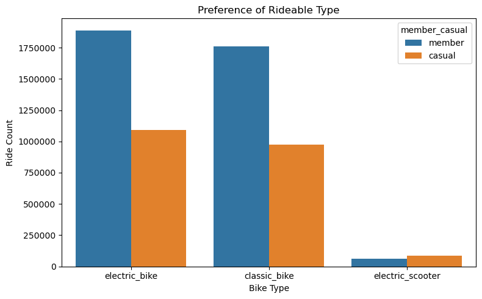

# 🚲 Divvy 2024 Trip Data Analysis

**By** Srivathsa Nadig

**Date:** 21/07/2025

---

# Defining The Problem Statement

**Problem Statement:**

Divvy aims to understand how their ride services are used across different rider types—specifically between **members** (subscribers) and **casual** (pay-per-ride) users—to uncover behavior patterns and guide future business strategies.

**Stakeholders:** Divvy Operations and Marketing Teams

---

## Aim

Support decisions based on user behavior insights:

1. Understand the **behavioral differences** between casual and member users.
2. Identify patterns in **ride time, frequency**, and **duration** across months, days, and hours.
3. Explore **user preferences** regarding rideable types.
4. Provide **actionable recommendations** based on visual analysis.

---

# Dataset

- Data from **January to December 2024**
- Removed location-based columns to focus on user behavior over time.
- Derived the following columns:

| rideable_type | started_at | ended_at | member_casual | ride_duration_min | month | day_of_week | hour |
| --- | --- | --- | --- | --- | --- | --- | --- |
| electric_bike | 2024-12-11 08:23 | 2024-12-11 08:37 | member | 13.81 | 12 | Wednesday | 8 |
| electric_bike | 2024-12-09 12:26 | 2024-12-09 12:37 | member | 11.28 | 12 | Monday | 12 |
| electric_bike | 2024-12-31 17:10 | 2024-12-31 17:17 | member | 7.30 | 12 | Tuesday | 17 |
- Null values were ignored due to high row count.

---

# Analysis

### 📅 Number of Rides vs Months

💡  Months are numbered from January (1) to December (12)  

**Observation:**

Ride count is highest during **summer months (June to September) (IN CHICAGO)**.

- Members ride more **consistently year-round**
- Casual riders peak in **warmer months**, indicating possible tourism/leisure use

---

### 🗓 Number of Rides vs Days of the Week

**Observation:**

- Members ride **consistently** on all weekdays
- Casual users spike on **Saturday and Sunday**, suggesting leisure or weekend events

---

### ⏰ Number of Rides vs Hour of the Day

**Observation:**

- Members show peaks around **8 AM** and **4–5 PM**, matching commute hours
- Casuals ride more between **11 AM and 5 PM**, likely for non-commute purposes

---

### 🕒 Average Ride Duration vs Month

*Duration in minutes* 

**Observation:**

- **Casual users consistently take longer rides** across all months
- Members make **shorter**, more frequent rides (likely for commuting)

---

### 🚲 Preference of Rideable Type

**Observation:**

- **Electric bikes** are the most used by both groups
- **Members** use **classic bikes** nearly equally
- **Docked bikes** are least used—likely due to availability or convenience

---

# Inferences

- Members use Divvy primarily for **short, consistent weekday commuting**
- Casual riders favor **weekend and midday** usage, hinting at tourists or leisure-seekers
- Ride duration and ride time vary greatly between user types
- Electric bikes dominate preference across both categories

---

# Suggestions

### 🧠 Targeted Digital Media Campaigns

Digital media can play a key role in converting **casual users to members**:

| Strategy | Medium | Target Behavior | Why it Converts |
| --- | --- | --- | --- |
| **Ride-triggered prompts** | In-app, Email | High frequency/long duration casuals | Shows cost/time benefit clearly |
| **End-of-ride popups** | In-app | All casuals | Leverages recency and ride satisfaction |
| **Geo-targeted ads** | Google, App | Near bike stations | Engages at high-intent moments |
| **Social campaigns** | Instagram, Twitter | Tourists, students, locals | Builds brand awareness |
| **Gamification** | App, Email | Repeat casuals | Adds fun, encourages loyalty |
| **Flash discounts** | Push notifications | All casuals | Creates urgency with limited-time offers |

**Example Digital Prompts:**

- *“You’ve taken 3 rides this week—get unlimited rides for just $10/month!”*
- *“Your ride was 25 mins – that would be free with a membership.”*
- *“Burned 300 calories this week? Share & save with a member discount!”*

---

# Conclusion

This analysis helped uncover distinct usage patterns between casual and member users. These insights can be leveraged to:

- **Boost membership signups** through personalized digital engagement
- **Improve customer retention** with loyalty and incentive programs