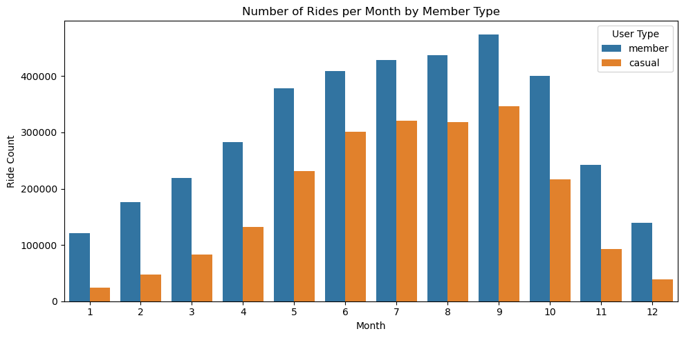
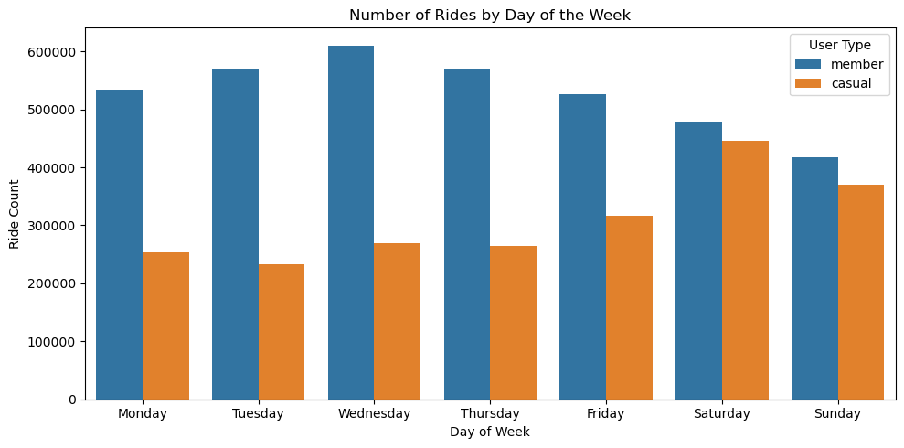
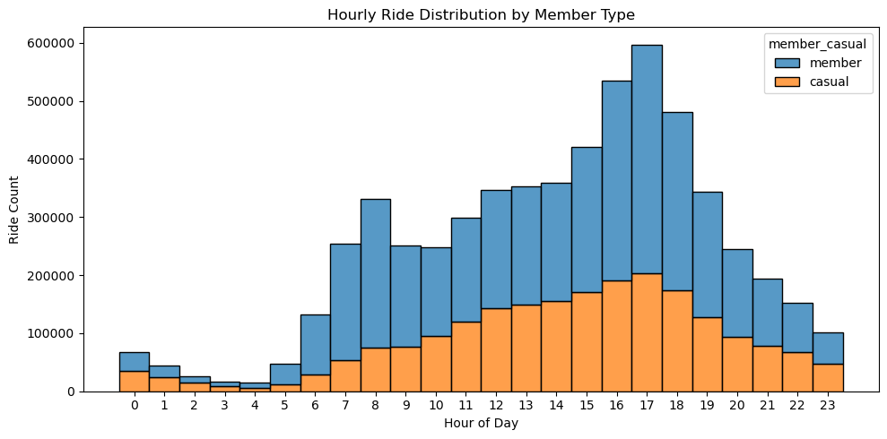
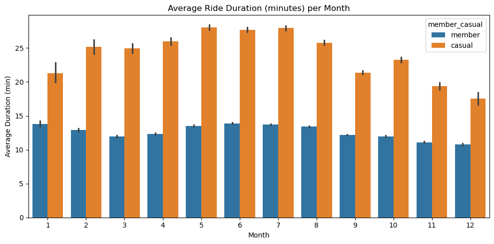
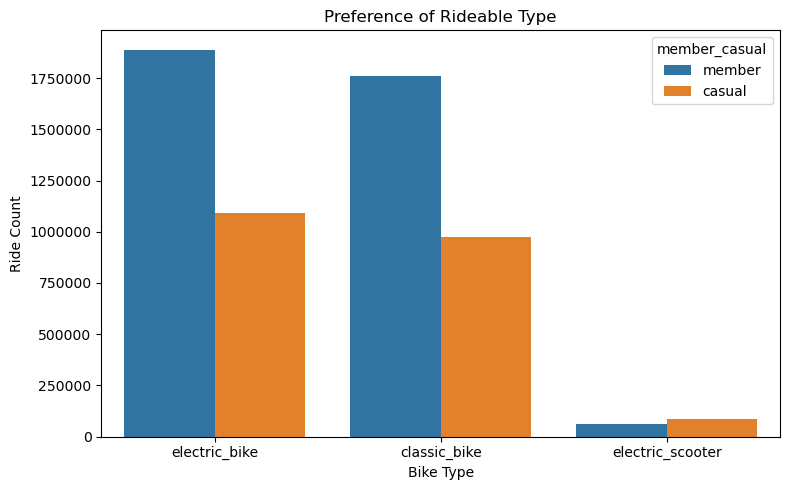

# Divvy Trip Data Analysis – 2024

**Author:** Srivathsa Nadig
**Date:** 21/07/2025 

This notebook analyzes the combined Divvy tripdata from 2024 and provides insights into usage behavior.


```python
import pandas as pd
import matplotlib.pyplot as plt
import seaborn as sns
from pathlib import Path
```


```python
df = pd.read_parquet("2024_divvy_tripdata.parquet")
```


```python
df.tail()
```


<div>
<style scoped>
    .dataframe tbody tr th:only-of-type {
        vertical-align: middle;
    }

    .dataframe tbody tr th {
        vertical-align: top;
    }

    .dataframe thead th {
        text-align: right;
    }
</style>
<table border="1" class="dataframe">
  <thead>
    <tr style="text-align: right;">
      <th></th>
      <th>ride_id</th>
      <th>rideable_type</th>
      <th>started_at</th>
      <th>ended_at</th>
      <th>start_station_name</th>
      <th>start_station_id</th>
      <th>end_station_name</th>
      <th>end_station_id</th>
      <th>start_lat</th>
      <th>start_lng</th>
      <th>end_lat</th>
      <th>end_lng</th>
      <th>member_casual</th>
    </tr>
  </thead>
  <tbody>
    <tr>
      <th>5860563</th>
      <td>BD56BA20F42E4794</td>
      <td>electric_bike</td>
      <td>2024-12-11 08:23:46.564</td>
      <td>2024-12-11 08:37:34.532</td>
      <td>Clybourn Ave &amp; Division St</td>
      <td>TA1307000115</td>
      <td>None</td>
      <td>None</td>
      <td>41.904634</td>
      <td>-87.640518</td>
      <td>41.880000</td>
      <td>-87.630000</td>
      <td>member</td>
    </tr>
    <tr>
      <th>5860564</th>
      <td>3074643A6B60B300</td>
      <td>electric_bike</td>
      <td>2024-12-09 12:26:15.677</td>
      <td>2024-12-09 12:37:32.712</td>
      <td>Canal St &amp; Jackson Blvd</td>
      <td>13138</td>
      <td>None</td>
      <td>None</td>
      <td>41.878125</td>
      <td>-87.639968</td>
      <td>41.900000</td>
      <td>-87.620000</td>
      <td>member</td>
    </tr>
    <tr>
      <th>5860565</th>
      <td>15602635C5DF484E</td>
      <td>electric_bike</td>
      <td>2024-12-31 17:10:03.113</td>
      <td>2024-12-31 17:17:21.838</td>
      <td>Albany Ave &amp; Bloomingdale Ave</td>
      <td>15655</td>
      <td>California Ave &amp; Milwaukee Ave</td>
      <td>13084</td>
      <td>41.914027</td>
      <td>-87.705126</td>
      <td>41.922695</td>
      <td>-87.697153</td>
      <td>member</td>
    </tr>
    <tr>
      <th>5860566</th>
      <td>F15ABBA961560B75</td>
      <td>electric_bike</td>
      <td>2024-12-01 14:39:47.216</td>
      <td>2024-12-01 14:45:21.268</td>
      <td>Albany Ave &amp; Bloomingdale Ave</td>
      <td>15655</td>
      <td>California Ave &amp; Milwaukee Ave</td>
      <td>13084</td>
      <td>41.914003</td>
      <td>-87.705099</td>
      <td>41.922695</td>
      <td>-87.697153</td>
      <td>member</td>
    </tr>
    <tr>
      <th>5860567</th>
      <td>8AF273287533B527</td>
      <td>electric_bike</td>
      <td>2024-12-17 06:38:32.320</td>
      <td>2024-12-17 06:46:27.167</td>
      <td>Albany Ave &amp; Bloomingdale Ave</td>
      <td>15655</td>
      <td>None</td>
      <td>None</td>
      <td>41.914027</td>
      <td>-87.705126</td>
      <td>41.920000</td>
      <td>-87.690000</td>
      <td>member</td>
    </tr>
  </tbody>
</table>
</div>


```python
df['started_at'] = pd.to_datetime(df['started_at'], format='mixed')
df['ended_at'] = pd.to_datetime(df['ended_at'], format='mixed')

```


```python
df = df.drop(['start_station_name','start_station_id','end_station_name','end_station_id','start_lat','start_lng','end_lat','end_lng'], axis=1)
```


```python
df['ride_duration_min'] = (df['ended_at'] - df['started_at']).dt.total_seconds() / 60
```


```python
df['month'] = df['started_at'].dt.month
df['day_of_week'] = df['started_at'].dt.dayofweek + 1
df['hour'] = df['started_at'].dt.hour
```


```python
df.columns = [col.strip().lower().replace(" ", "_") for col in df.columns]
```


```python
plt.figure(figsize=(10, 5))
sns.countplot(data=df, x='month', hue='member_casual')
plt.title("Number of Rides per Month by Member Type")
plt.xlabel("Month")
plt.ylabel("Ride Count")
plt.legend(title="User Type")
plt.tight_layout()
plt.show()

```


    

    


```python
df['day_of_week'] = df['started_at'].dt.day_name()
week_order = ["Monday", "Tuesday", "Wednesday", "Thursday", "Friday", "Saturday", "Sunday"]

plt.figure(figsize=(10, 5))
sns.countplot(data=df, x='day_of_week', hue='member_casual', order=week_order)
plt.title("Number of Rides by Day of the Week")
plt.xlabel("Day of Week")
plt.ylabel("Ride Count")
plt.legend(title="User Type")
plt.tight_layout()
plt.show()
```


    

    


```python
plt.figure(figsize=(10, 5))
sns.histplot(data=df, x='hour', hue='member_casual', multiple='stack', bins=24, discrete=True)
plt.title("Hourly Ride Distribution by Member Type")
plt.xlabel("Hour of Day")
plt.ylabel("Ride Count")
plt.xticks(ticks=range(0, 24))  # Show 0 to 23 explicitly
plt.tight_layout()
plt.show()
```


    

    


```python
# Plot 4: Average Ride Duration per Month
plt.figure(figsize=(10, 5))
sns.barplot(data=df, x='month', y='ride_duration_min', hue='member_casual', estimator='mean')
plt.title("Average Ride Duration (minutes) per Month")
plt.xlabel("Month")
plt.ylabel("Average Duration (min)")
plt.tight_layout()
plt.show()
```


    

    


```python
import matplotlib.ticker as mtick  # Add this at the top if not already imported

plt.figure(figsize=(8, 5))
sns.countplot(data=df, x='rideable_type', hue='member_casual')
plt.title("Preference of Rideable Type")
plt.xlabel("Bike Type")
plt.ylabel("Ride Count")

# 👇 This forces plain numbers (no exponents)
plt.ticklabel_format(axis='y', style='plain')
plt.tight_layout()
plt.show()

```


    

    


```python
# Save cleaned dataset
df.to_parquet("divvy_tripdata_2024_cleaned.parquet", index=False)
```
