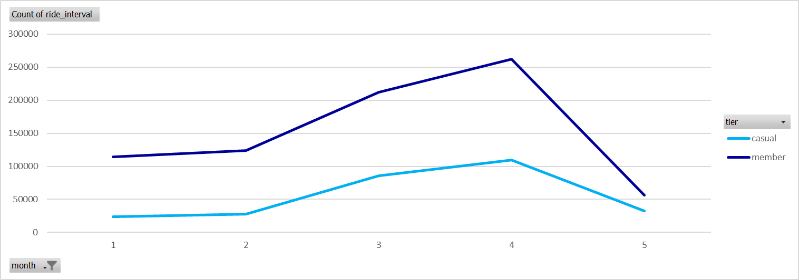

# Cyclistic Analysis Report 1

By Srivathsa Nadig

16/07/2025

# Defining The Problem Statement

**Problem Statement** : Cyclistic, a bike share company is unable to convert their casual members (single-ride and full-day tier users) into cyclist members (annual users).

This is to maximize profits as the stakeholders claim that most of their profits are contributed by Cyclist members.

**Stakeholders :** Cyclistic Marketing Director- Lily Moreno

## Aim

Support decisions based on business insights

1. To understand the **difference** in behavior between annual and casual members
2. To explore why casual users might **prefer** an annual membership
3. How can Cyclistic use **digital media** to **influence** casual riders to become members?

---

# Dataset

- Only data from 2025 was included; January to June (as per excels capabilities)

| ride_id | rideable_type | started_at | ended_at | start_station_name | start_station_id | end_station_name | end_station_id | start_lat | start_lng | end_lat | end_lng | member_casual |
| --- | --- | --- | --- | --- | --- | --- | --- | --- | --- | --- | --- | --- |
| A246CA24873F7C5C | classic_bike | 21:21.2 | 30:09.9 | Michigan Ave & Lake St | TA1305000011 | Clark St & Elm St | TA1307000039 | 41.88602 | -87.6244 | 41.90297 | -87.6313 | member |
| 303C0906F3F068AE | classic_bike | 55:13.5 | 13:39.9 | Ogden Ave & Race Ave | 13194 | Clark St & Elm St | TA1307000039 | 41.8918 | -87.6588 | 41.90297 | -87.6313 | member |
| A0F65F3531F1FB2B | electric_bike | 32:56.6 | 38:21.7 | Michigan Ave & Lake St | TA1305000011 | Wabash Ave & 9th St | TA1309000010 | 41.88602 | -87.6244 | 41.87077 | -87.6257 | casual |
- Removed location-specific columns as they do not align with the problem statement.
- However, a simple observation was made were the number of trips made between 2 points were more with annual members than casual users.
- To understand the behavior, a column calculating the duration of ride, day of the week, hour of start time of the ride occurred and the month were obtained and added as new columns.
- In the end we are left with the follows:

| hour | started_at | ended_at | tier | ride_interval | month | day_of_week | hours_time |
| --- | --- | --- | --- | --- | --- | --- | --- |
| classic_bike | 1/21/25 5:23 PM | 1/21/25 5:37 PM | member | 0:13:57 | 1 | 2 | 17 |
| electric_bike | 1/11/25 3:44 PM | 1/11/25 3:49 PM | member | 0:05:04 | 1 | 6 | 15 |
| classic_bike | 1/2/25 3:16 PM | 1/2/25 3:28 PM | member | 0:11:36 | 1 | 4 | 15 |
- Due to abundance of data, rows with null values may be ignored.

# Analysis

### Number of Rides vs Months

**Observation:** Usage of the services were high in April and March in both tiers. The annual members seem to make more use of the services than the casual members

### Count of Rides vs Weeks

**Observation:** Annual members seem to use the services throughout the week . As for the casual members the usage is steady through the week but spikes up on Friday and Saturday.

### Number of Rides vs Hour of the day

### Average Ride Duration across the Months

**Observation:** Although annual members use the services a lot, their usage in terms of duration seems to be shorter than the casual users.

There also seems to be a rise in the average ride duration by the casual tier users.

### Preference of *rideable_type*

- Users from both tiers seem to prefer electric bikes from the chart above. However, the selection of rideable may also depend on the availability of bikes at said station.

---

## Inferences

- Annual members make use of our services for short rides through the week.
- Casual members seem to use the services more on Fridays and Saturdays. This could hint at a group of users that maybe tourists, audience attending events, etc.

**Suggestions**

Digital Media can be made visible to users near stations.

Prompts can be made for casual users to become Cyclistic members after certain number of rides.

“3 more minutes and you are close to a Cyclist Member!”

A seasonal membership can also be introduced to casual users to take advantage of peak seasons. Ads can also be targeted more during this period.

In case casual users exceed time limits they could be fined or prompted to Cyclistic membership.

Gamify the experience by showing them calories burnt and time spent which can be shared through social media as well